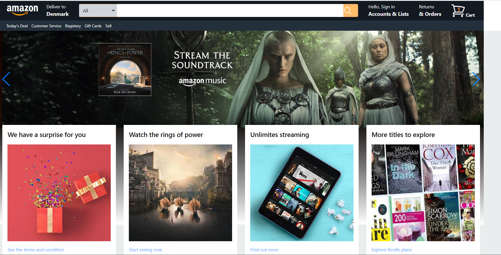
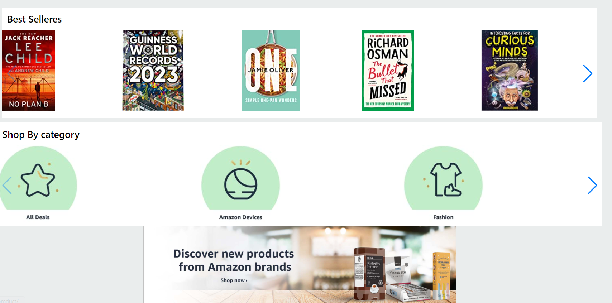
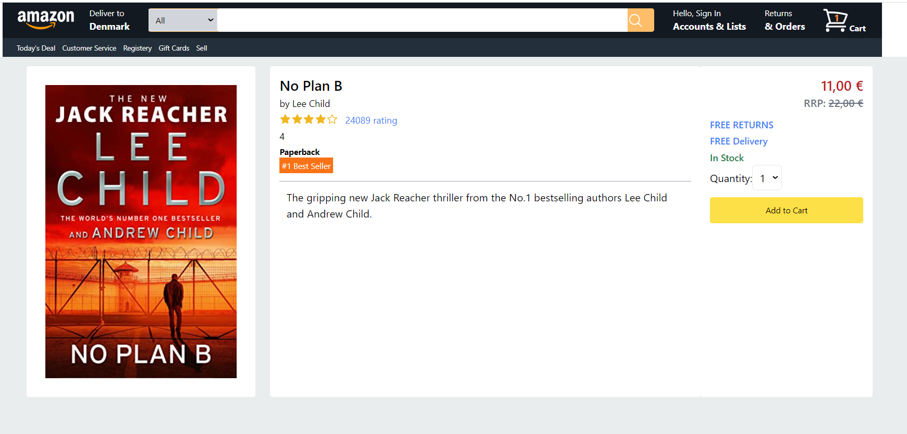
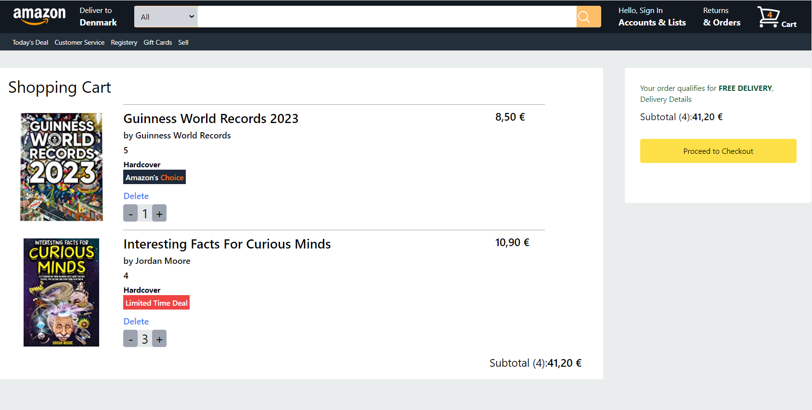

# Amazon Clone React App
Amazon clone app created using react with tailwind css. Added functionality to search for the product, add to cart and checkout page.
For state managemnt used Redux.Done as part of hobby project.

## Start the app

In the project directory, you can run:

### `npm start`

## Features

### Home Page
Contains Carousel containing images and video.

### NavBar
Complete with Search box that offers suggestions as you type

### Product Page
Page shows details of product, ratings and add to cart option

### Product Search
Functionality to search for products showing the recommendations and also to select from dropdown

### Checkout Page
Page with functionality which shows total items ,total amount that has been ordered
